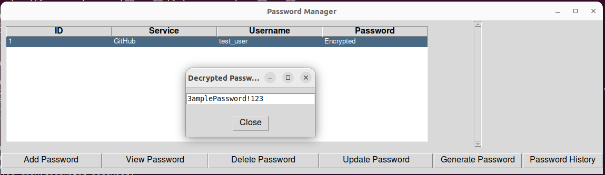

# Password Manager App

This is a simple offline password manager application built using Python and the Tkinter library. The app allows users to securely store, view, update, generate random passwords and delete passwords for various services. Passwords are encrypted using the Fernet symmetric encryption algorithm, and a password history is maintained for each entry. This app is an enhancement on ALL the password manager apps out there because it completely offline and nothing is sent/stored on the cloud. 
### **This app was built because my mom always keeps forgetting her passwords and always needs help resetting them 😊.**

### Here's a screenshot of the app: <br/>

## Prerequisites

- Python 3.x
- Tkinter library
- cryptography library
- sqlite3 library
- pyperclip library

## Installation

1. Clone the repository or download the script.
2. Install the required dependencies:

   ```bash
   pip install -r requirements.txt
   ```

3. Run the script
    ```bash
    python password-manager.py
    ```
## Features

- **Add Password:** Store passwords for different services securely.
- **View Passwords:** Display a list of stored passwords with encrypted representations.
- **View Password:** View the decrypted password for a selected service.
- **Delete Password:** Remove a stored password after confirmation.
- **Generate Password:** Create a random password with specified length and complexity.
- **Password History:** View the history of password changes for a selected service.
- **Update Password:** Change the password for a selected service.

## Usage
1. Launch the application.
2. Use the provided buttons to manage passwords.
3. For each stored password, you can view, update, or delete it.
4. Generate strong and random passwords using the "Generate Password" button.

## Security
- Passwords are stored in an encrypted format using the Fernet encryption algorithm.
- Password changes are tracked in a separate history database.

# OPTIONAL
## Create Standalone Executable (Windows)
To create a standalone executable (.exe) file using PyInstaller, follow these steps:
- Install PyInstaller
```bash
cd FalconHacksV2
```

- Run PyInstaller
```bash
pyinstaller --onefile --noconsole password-manager.py
```

The executable file will be generated in the dist directory.

### Test the executable
Navigate to the dist directory and run the generated executable.
```bash
cd dist
password-manager.exe
```

NOTE: This is on a Windows machine.

## Create a .app/dmg file for MacOS
1. Install Required Dependencies: <br/>
Ensure that you have the necessary dependencies installed on your development machine:
```bash
pip install -r requirements.txt
```
2. Package the App<br/>
Install py2app, a tool for building standalone Mac applications:
```bash
pip install py2app
```

3. Navigate to the directory containing your `password-manager.py`

4. Run the following command to create a standalone .app bundle:
```bash
py2applet --make-setup password-manager.py
python setup.py py2app
```
This will generate a dist directory containing the .app bundle.

5. Create a DMG File: <br/>
Install `create-dmg`, a tool for creating DMG files:
```bash
npm install -g create-dmg
```

6. Navigate to the `dist` directory:
```bash
cd dist
```

7. Run the following command to create a DMG file:
```bash
create-dmg 'Password Manager App.app' --overwrite --dmg-title='Password Manager App'
```
Adjust the `--dmg-title` parameter according to your application's name.

8. After the command completes, you will find the generated DMG file in the `dist` directory.

9. Test the Application:<br/>
- Mount the DMG file and drag the application to the Applications folder.
- Launch the application from the Applications folder to ensure it works correctly.

10. Distribute the DMG File<br/>
- You can now distribute the DMG file to users. They can download the DMG file, mount it, and then drag the application to their Applications folder.


### Contributing
Contributions are welcome! Please fork the repository and submit a pull request with your changes.

### License
This project is licensed under the MIT License - see the LICENSE file for details.
```bash
Replace "yourusername" with your actual GitHub username or the organization name where you host the repository.
Feel free to customize this template based on your project's specific details and requirements. Add more sections if needed, such as "Troubleshooting," "Testing," or "Acknowledgments." The goal is to provide clear and comprehensive information for users and potential contributors.

```